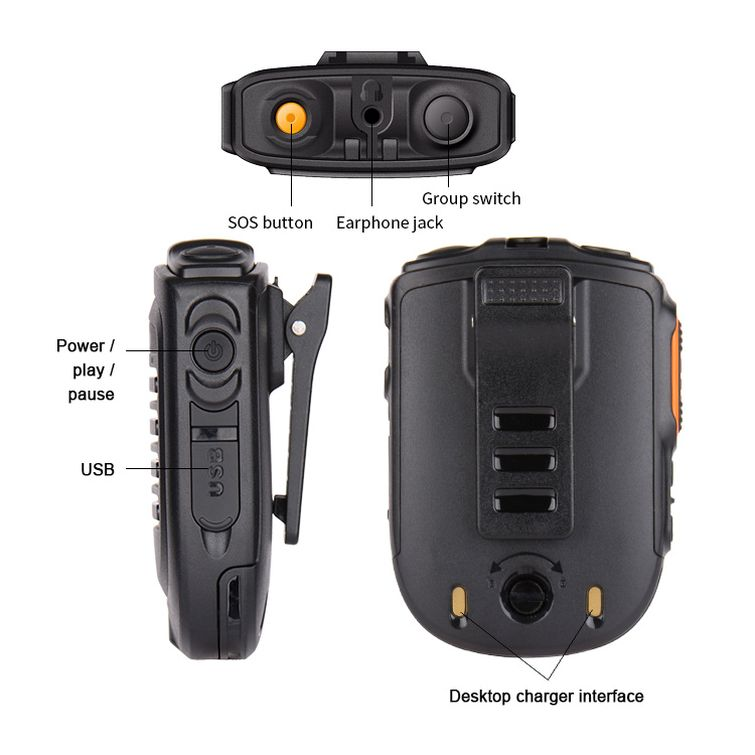

# ptt-audio-menu

Screenless, audio-first menu runtime for a Bluetooth remote speaker microphone
(RSM). It turns serial button events from the RSM into tool switching, command
execution, native recording packets, and spoken feedback.



The target RSM address is configured in TOML:

- Device name: `B02PTT-FF01`
- Example Bluetooth MAC: `00:02:5B:55:FF:01`
- Service: RFCOMM Serial Port Profile, UUID `00001101-0000-1000-8000-00805f9b34fb`
- SDP service name: `GAIA`

## Status

Implemented:

- Platform transport abstraction. On Linux, BlueZ RFCOMM profile
  registration and connection through `bluer`. On macOS, a paired
  Bluetooth SPP serial-port file (e.g. `/dev/cu.<name>-SPPDev`) opened
  with `tokio-serial`; the user pairs the device once in System Settings
  → Bluetooth and supplies the path via `bluetooth.serial_port`.
- Token-scanning parser for concatenated/split/noisy serial button codes.
- Active/control hardware mode normalization.
- TOML config loading and validation.
- Tabbed audio menu state.
- Internal actions, argv-list command actions, command timeout, and command
  process-group cancellation on Unix.
- Piper TTS prerendering with stable WAV cache keys.
- Kira prompt playback with interrupt-latest behavior.
- Audio output routing. On Linux, PipeWire Bluetooth sink routing through
  `PIPEWIRE_NODE`. On macOS, cpal output-device selection by name via
  `audio.device` (cpal's CoreAudio backend enumerates Bluetooth A2DP sinks).
- Native CPAL recording packets written as 16 kHz mono PCM WAV.
- Durable packet queues with retry/backoff, stale processing recovery, and
  dead-letter handling.
- Built-in Daily Log packet processor using local Parakeet TDT model files.
- Nix package, NixOS module, Home Manager module, and hardware-free flake
  checks. The package and dev shell build on Linux and macOS (aarch64-darwin
  and x86_64-darwin); NixOS/Home Manager module checks remain Linux-only.

Known constraints:

- Bluetooth pairing/device discovery is not implemented. On macOS, the RSM
  must be paired in System Settings → Bluetooth before running; the SPP serial
  node macOS creates is referenced via `bluetooth.serial_port`.
- Command actions are argv-list only; shell-string command actions are rejected.
- ASR model files are not downloaded or packaged; see the README's
  Configuration section for the Piper voice and Parakeet TDT model paths.
- Packet requeue is automatic only; there is no manual requeue CLI.

## Hardware Controls

The RSM has two hardware modes:

| Mode | LED | Buttons |
| --- | --- | --- |
| Active | Blinking green | PTT, Group, SOS emit serial events. Volume keys control hardware volume and do not emit serial events. |
| Control | Solid green | Group cycles tabs. Volume Up/Down scroll items. PTT selects and returns to Active. SOS triggers alternate item actions without leaving Control. |

Serial tokens:

| Token | Event |
| --- | --- |
| `+PTT=P` | PTT pressed |
| `+PTT=R` | PTT released |
| `C:SP*` | SOS pressed |
| `C:SR*` | SOS released |
| `C:SOS*` | SOS long-pressed |
| `C:GP*` | Group pressed |
| `C:GR*` | Group released |
| `C:VP*` | Volume Up clicked |
| `C:VM*` | Volume Down clicked |

## Runtime Model

Each configured tool has:

- Active hooks: `ptt`, `sos_short`, `sos_long`.
- Local control tabs.
- Spoken labels for the tool, tabs, and items.

Global tabs are available from every tool. Control focus is remembered across
control exit and compatible tool switches.

Active PTT trigger modes:

| Mode | Behavior |
| --- | --- |
| `release_after_hold` | Default. Fires active PTT action on release only if held for `active_ptt_hold_ms`. |
| `press` | Fires immediately on press. |
| `hold_toggle` | Fires once when the hold threshold elapses, then again on release only if threshold fire occurred. |

Recording packet actions use PTT edges directly: press starts recording, release
stops recording and enqueues the packet.

## Build

Use the Nix dev shell. Do not run host `cargo` directly unless the required
native libraries are already available.

```sh
nix develop
cargo check
cargo test
cargo run -- --config examples/config.validation.toml --check-config
```

Equivalent one-shot commands:

```sh
nix develop --command cargo fmt --check
nix develop --command cargo test
nix develop --command cargo check
```

## Run

Validate a config without TTS rendering or Bluetooth startup:

```sh
nix develop --command cargo run -- --config examples/config.validation.toml --check-config
```

Run the normal hardware path:

```sh
nix develop --command cargo run -- --config /path/to/config.toml
```

Without `--config`, the program resolves:

1. `$XDG_CONFIG_HOME/ptt-audio-menu/config.toml`
2. `~/.config/ptt-audio-menu/config.toml`

Set logging with `RUST_LOG`, for example:

```sh
RUST_LOG=ptt_audio_menu=debug,info nix develop --command cargo run -- --config /path/to/config.toml
```

## Configuration

Minimal shape:

```toml
default_tool = "radio"

[bluetooth]
device = "00:02:5B:55:FF:01"

[voice]
model_path = "/path/to/voice.onnx"
config_path = "/path/to/voice.json"

[globals]
active_ptt_hold_ms = 350
active_ptt_trigger = "release_after_hold"

[cache]
tts_dir = "/tmp/ptt-audio-menu/tts"

[[tools]]
id = "radio"
label = "Radio"

[tools.active_hooks]
ptt = "talk"
sos_short = "status"
sos_long = "cancel"

[[global_tabs]]
id = "system"
label = "System"

[[global_tabs.items]]
id = "reload"
label = "Reload config"
primary_action = "reload-config"

[[actions]]
id = "talk"
type = "internal"
command = "noop"

[[actions]]
id = "status"
type = "internal"
command = "speak"
text = "Ready"

[[actions]]
id = "cancel"
type = "internal"
command = "cancel_running_action"

[[actions]]
id = "reload-config"
type = "internal"
command = "reload_config"
text = "Reload failed"
```

On macOS, pair the RSM in System Settings → Bluetooth first, then add
`bluetooth.serial_port` pointing at the SPP serial node macOS creates for the
device (the name is derived from the device's Bluetooth name, not its MAC):

```toml
[bluetooth]
device = "00:02:5B:55:FF:01"
serial_port = "/dev/cu.B02PTT-FF01-SPPDev"
```

Optionally set `audio.device` to a cpal output device name (e.g. the RSM's
A2DP sink name as shown by `system_profiler SPAudioDataType`) to route prompts
there; otherwise the system default output is used.

ID rules:

- IDs are strict lowercase slugs: lowercase ASCII letters, digits, and single
  hyphens.
- IDs must not be empty, start/end with `-`, or contain `--`.
- Tool IDs are unique within tools.
- Action IDs are unique within actions.
- Tab and item IDs are unique within their containing namespace.

Action types:

| Type | Fields |
| --- | --- |
| `internal` | `command`, optional `tool`, optional `text` |
| `command` | `argv`, optional `cwd`, optional `env`, optional `timeout_ms`, optional feedback |
| `recording_packet` | `storage_dir`, `processor`, retry/backoff fields, optional recording feedback |

Internal commands:

- `switch_tool`
- `speak`
- `noop`
- `exit_control`
- `reload_config`
- `stop_audio`
- `cancel_running_action`

Command actions execute without a shell. Use explicit argv arrays:

```toml
[[actions]]
id = "run-date"
type = "command"
argv = ["date"]
timeout_ms = 2000

[actions.feedback]
start = "Running command"
success = "Command completed"
failure = "Command failed"
```

Recording packet action:

```toml
[[actions]]
id = "daily-log-record"
type = "recording_packet"
storage_dir = "/tmp/ptt-audio-menu/daily-log/packets"
max_attempts = 3
initial_backoff_ms = 1000
max_backoff_ms = 60000

[actions.feedback]
start = "Recording"
stop = "Stopped"
enqueued = "Daily log queued"
failure = "Recording failed"

[actions.processor]
kind = "daily_log_parakeet"
model_dir = "/tmp/parakeet-tdt-v3"
daily_json_dir = "/tmp/ptt-audio-menu/daily-log/json"
html_dir = "/tmp/ptt-audio-menu/daily-log/html"
renderer_script = "examples/daily_log_render.py"
```

See:

- `examples/config.validation.toml`: hardware-free validation fixture.
- `examples/config.personal-workflow.toml`: Handy dictation plus Daily Log
  workflow.
- `examples/daily_log_render.py`: simple JSON-to-HTML renderer for Daily Log.

## Audio And TTS

Startup sequence:

1. Load and validate config.
2. Collect all prompt text from tools, tabs, items, internal `speak` actions,
   command feedback, and recording feedback.
3. Render missing prompts with Piper.
4. Cache WAV prompts using a hash of text, voice paths, Piper settings, output
   format, and app version.
5. Connect Bluetooth transport. On Linux, register and accept the BlueZ
   RFCOMM profile. On macOS, open the configured `bluetooth.serial_port`
   serial-port file.
6. Initialize Kira audio and speak the active tool label.

Audio routing:

- On Linux, runtime derives `bluez_output.<MAC_WITH_UNDERSCORES>.1` from
  `[audio].device`, or from `[bluetooth].device` when `[audio].device` is
  omitted, and sets `PIPEWIRE_NODE` before Kira/cpal initializes. This avoids
  runtime `pw-dump` calls and cpal output-device enumeration, which does not
  expose PipeWire-native Bluetooth sinks on this system.
- On macOS, cpal's CoreAudio backend can enumerate Bluetooth A2DP sinks
  directly. When `[audio].device` is set, runtime resolves the cpal output
  device by name and passes it to Kira's `CpalBackendSettings`. When
  `[audio].device` is omitted, the system default output is used.
  `[bluetooth].device` is not used for audio routing on macOS.

The Nix dev shell and modules set:

```sh
PIPER_ESPEAKNG_DATA_DIRECTORY=${espeak-ng}/share
```

`espeak-rs` appends `espeak-ng-data` internally.

## Packet Queue Layout

Each `recording_packet` action stores packets under:

```text
<storage_dir>/
  queued/
  processing/
  processed/
  dead-letter/
```

Each packet has:

- `<packet_id>.wav`: 16 kHz mono PCM WAV.
- `<packet_id>.json`: operational metadata with action/tool IDs, status,
  timestamps, attempts, retry time, errors, and processed time.

On startup, stale `processing` packets are recovered to `queued`.

## Nix Package And Modules

Build package:

```sh
nix build .#packages.x86_64-linux.default    # Linux
nix build .#packages.aarch64-darwin.default  # macOS (Apple Silicon)
```

NixOS module:

```nix
{
  imports = [ inputs.ptt-audio-menu.nixosModules.default ];

  services.ptt-audio-menu = {
    enable = true;
    configPath = /etc/ptt-audio-menu/config.toml;
    environment.RUST_LOG = "ptt_audio_menu=debug,info";
  };
}
```

Home Manager module:

```nix
{
  imports = [ inputs.ptt-audio-menu.homeManagerModules.default ];

  programs.ptt-audio-menu = {
    enable = true;
    configPath = "${config.xdg.configHome}/ptt-audio-menu/config.toml";
    service.enable = true;
  };
}
```

More details: `docs/nix-modules.md`.

## Verification

Rust checks:

```sh
nix develop --command cargo fmt --check
nix develop --command cargo test
nix develop --command cargo check
```

Flake checks:

```sh
nix flake check --no-build
nix build .#checks.x86_64-linux.nixos-module
nix build .#checks.x86_64-linux.home-manager-module
nix build .#checks.x86_64-linux.nixos-real-package-help
nix build .#checks.x86_64-linux.nixos-real-package-config
nix build .#checks.x86_64-linux.home-manager-real-package-help
nix build .#checks.x86_64-linux.home-manager-real-package-config
nix build .#checks.x86_64-linux.nixos-service-vm
```

Full check:

```sh
nix flake check
```

The full check may require more `/nix/store` capacity than small sandbox stores
provide because it realizes the Rust/audio/TTS/ONNX package closure and the VM
closure.

## Source Layout

| Path | Responsibility |
| --- | --- |
| `src/main.rs` | CLI, runtime state, config reload, TTS/audio startup, RFCOMM loop, action wiring |
| `src/transport.rs` | Platform transport: BlueZ RFCOMM on Linux, `tokio-serial` SPP port on macOS |
| `src/parser.rs` | Serial token scanner |
| `src/input.rs` | Hardware mode and button semantic normalization |
| `src/config.rs` | TOML schema, path resolution, validation |
| `src/menu.rs` | Active/control menu state and focus |
| `src/actions.rs` | Action lookup and dispatch effects |
| `src/commands.rs` | Async serial command runner and cancellation |
| `src/tts.rs` | Prompt collection, Piper rendering, WAV cache |
| `src/audio.rs` | Kira prompt playback and audio sink routing (PipeWire on Linux, cpal device on macOS) |
| `src/recorder.rs` | CPAL recording and 16 kHz mono WAV encoding |
| `src/packets.rs` | Durable packet queues and Daily Log processor |
| `nix/package.nix` | Rust package derivation |
| `nix/nixos-module.nix` | NixOS service module |
| `nix/home-manager-module.nix` | Home Manager module |
